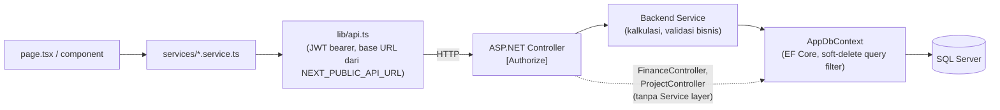
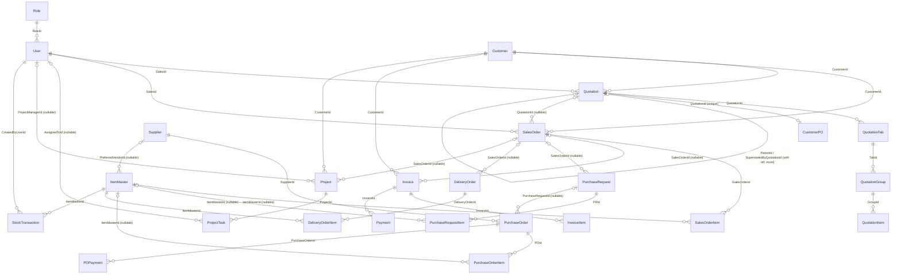
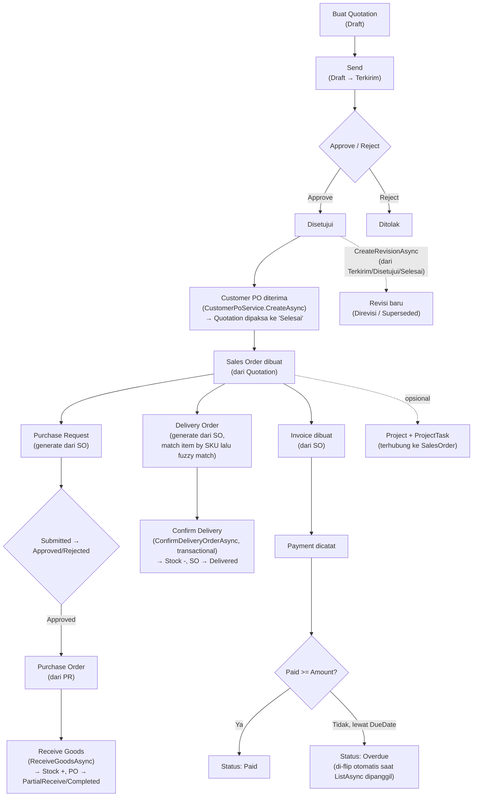

> Dokumen ini menjelaskan **bagaimana sistem Syntera ERP dirancang dan bekerja** — pattern, layer, workflow, relasi data, dan business rule. Dokumen ini **tidak** membahas persentase progress atau status "selesai/belum" — untuk itu lihat [`PROJECT_STATUS.md`](./PROJECT_STATUS.md).
>
> Sumber: source code aktual di `SynteraERP_Backend/SynteraERP.Api` (ASP.NET Core 8) dan `FrontEnd_Syntera/src` (Next.js 15). Semua klaim di bawah merujuk ke file/baris kode nyata. Jika kode dan `database/schema.sql` berbeda, **kode EF Core (Models + Migrations) adalah sumber kebenaran** — lihat bagian [Domain Model & Database Relationships](#domain-model--database-relationships) untuk daftar ketidaksesuaian.

# Architecture Pattern

Syntera ERP adalah dua aplikasi terpisah yang berkomunikasi lewat REST API:

- **Backend**: satu project ASP.NET Core 8 Web API (`SynteraERP.Api`), pola **layered architecture** klasik: `Controller → Service → EF Core DbContext → SQL Server`. Ini **bukan** Clean Architecture/CQRS — tidak ada pemisahan Domain/Application/Infrastructure sebagai project terpisah, tidak ada MediatR, AutoMapper, atau FluentValidation di `.csproj` (dikonfirmasi: hanya 6 package reference — `BCrypt.Net-Next`, `JwtBearer`, `EntityFrameworkCore.SqlServer`, `EntityFrameworkCore.Tools`, `QuestPDF`, `Swashbuckle.AspNetCore`).
- **Frontend**: Next.js 15 App Router, `page.tsx → component → service (fetch wrapper) → backend API`. Tidak ada global state library yang benar-benar dipakai (folder `src/stores` tidak ada di codebase, meski sempat direncanakan).

Pola ini diterapkan **cukup konsisten tapi tidak 100%** — dua controller (`FinanceController`, `ProjectController`) melewati Service layer dan langsung meng-inject `AppDbContext`, sementara controller lain (`QuotationController`, `SalesOrderController`, `PurchaseController`, dll.) benar mengikuti pola Controller→Service.

# Layers & Folder Responsibilities

## Backend (`SynteraERP.Api/`)

| Folder | Tanggung jawab |
|---|---|
| `Controllers/` | Endpoint HTTP, routing, `[Authorize]`. Idealnya tipis dan delegasi ke Service — lihat pengecualian di atas. |
| `Services/` + `Services/Interfaces/` | Business logic: kalkulasi total, validasi status, alur numbering, mutasi stok. Setiap service pegang `AppDbContext` langsung (tidak ada Repository/Unit-of-Work abstraction). |
| `Models/` (+ `Models/Common/BaseEntity.cs`) | EF Core entity classes. `BaseEntity` menyediakan `Id (Guid)`, `CreatedAt`, `UpdatedAt`, `CreatedBy (Guid?)`, `UpdatedBy (Guid?)`, `IsDeleted`. |
| `DTOs/` | Request/response contract, satu folder per modul (Auth, Customer, Quotation, dst). |
| `Data/AppDbContext.cs` | DbContext: DbSets, Fluent API relationship config, global soft-delete query filter, seed data. |
| `Middleware/ExceptionMiddleware.cs` | Satu-satunya middleware cross-cutting — global exception handler. |
| `Helpers/` | `JwtHelper` dan util lain. |
| `Migrations/` | Riwayat migrasi EF Core (15 migrasi bernama + snapshot model saat ini). |

## Frontend (`src/`)

| Folder | Tanggung jawab |
|---|---|
| `app/<modul>/page.tsx` | Route per modul, sesuai struktur folder Next.js App Router. |
| `app/<modul>/[id]/`, `app/<modul>/buat/` | Halaman detail dan halaman create khusus modul. |
| `app/<modul>/components/` | Komponen presentasional scoped ke satu modul (Table, SummaryCards). |
| `components/`, `components/ui/` | Komponen reusable lintas modul: `StatusBadge`, `SummaryCards`, `TableToolbar`, `TablePagination`, `ERPModal`, `ConfirmModal`, `RowActionMenu`. |
| `services/*.service.ts` | Wrapper pemanggilan API per modul, dibangun di atas `lib/api.ts`. |
| `lib/api.ts` | Fetch wrapper: attach JWT bearer token dari `localStorage`, auto-redirect ke `/login` saat 401. |
| `lib/format.ts`, `lib/export.ts`, `lib/queryClient.ts` | Util format angka/tanggal, export, dan React Query client. |
| `types/index.ts` | Definisi TypeScript domain type bersama (Customer, Quotation, SalesOrder, dll). |
| `hooks/useTableFilter.ts` | State search/filter/sort/pagination client-side yang dipakai berulang di banyak tabel. |

# Dependency Flow



# Domain Model & Database Relationships

**Catatan penting:** file `database/schema.sql` di root repo frontend adalah rancangan awal/aspirational dan **sudah tidak sinkron** dengan skema yang benar-benar berjalan (dikelola EF Core Migrations). Contoh perbedaan nyata:

- Tabel `Categories`, `Brands`, `Units`, `Items`, `GoodsReceipts`, `GoodsReceiptItems`, `SupplierInvoices`, `SupplierPayments` ada di `schema.sql` tapi **tidak pernah dibuat** oleh EF Core — tidak ada model C# untuk itu. `ItemMaster` (pengganti `Items`) memakai field string biasa (`Category`, `Brand`, `Uom`), bukan tabel lookup terpisah. Penerimaan barang (goods receipt) dicatat langsung di `PurchaseOrderItem.ReceivedQty`, bukan tabel `GoodsReceipts` terpisah.
- Entity yang **ada di EF Core tapi tidak ada di `schema.sql`**: seluruh modul `Project`/`ProjectTask`, `SalesOrderItem`, `InvoiceItem`, `POPayment`, `DeliveryOrder`/`DeliveryOrderItem`, `StockTransaction`, `CustomerPO`, `CompanySettings`, `AuditLog`.
- Views (`vw_ARSummary`, `vw_APSummary`) dan stored procedure (`sp_GetNextDocNo`, `sp_UpdateInvoiceStatus`) yang didefinisikan di `schema.sql` **tidak pernah dipanggil dari C#** (nol referensi `FromSqlRaw`/`ExecuteSqlRaw` di seluruh backend) — logika yang sama direimplementasi manual di C# (`NumberingConfig.GenerateNext()`, LINQ untuk AR/AP). Views/procs ini adalah artefak schema mati.

ER diagram di bawah merepresentasikan skema EF Core yang aktual (`Models/*.cs`, `Data/AppDbContext.cs`, `Migrations/*ModelSnapshot.cs`):



Tidak ada relasi many-to-many (N-N) sejati di seluruh model — semua relasi adalah 1-N atau 1-1 opsional (`CustomerPO` ↔ `Quotation`).

**Audit fields**: pattern `CreatedAt/UpdatedAt/CreatedBy/UpdatedBy/IsDeleted` dari `BaseEntity` diterapkan hanya pada entity level-atas/parent (16 dari ~27 model class): `Role, User, Customer, Supplier, ItemMaster, Quotation, CustomerPO, SalesOrder, SalesOrderItem, PurchaseRequest, PurchaseOrder, Invoice, Project, ProjectTask, StockTransaction, DeliveryOrder`. Entity anak/line-item (`QuotationTab/Group/Item`, `PurchaseRequestItem`, `PurchaseOrderItem`, `POPayment`, `InvoiceItem`, `DeliveryOrderItem`) dan entity standalone (`NumberingConfig`, `CompanySettings`, `AuditLog`) **tidak** punya field audit lengkap — mereka bergantung pada cascade-delete dari parent, bukan soft-delete individual.

Global soft-delete query filter (`AppDbContext.cs:60-72`, `452`, `470`) aktif untuk: `User, Customer, Supplier, ItemMaster, Quotation, CustomerPO, SalesOrder, Invoice, PurchaseRequest, PurchaseOrder, StockTransaction, DeliveryOrder, Project, ProjectTask`. `Role` dan `SalesOrderItem` punya kolom `IsDeleted` tapi **tidak** difilter otomatis.

# Business Workflow

Alur end-to-end yang benar-benar terimplementasi di kode (Controller + Service), bukan alur ideal:



Catatan alur:
- **Approval workflow** hanya ada untuk Quotation (`ApproveAsync`/`RejectAsync`, hanya valid dari status `Terkirim`) dan Purchase Request (state-machine transisi formal di `PurchaseRequestService.cs:103-112`). Modul lain (SalesOrder, PurchaseOrder, DeliveryOrder) tidak punya validasi transisi status — endpoint PATCH status generik menerima transisi status apa pun.
- Tidak ada entity `Approval`/`ApprovalHistory` terpisah — riwayat approval hanya berupa satu field `ApprovedAt`/`ApprovedBy` (atau `ApprovedByUserId`) di baris parent, sehingga tidak merepresentasikan approval berjenjang/multi-step.
- Stock bertambah di 3 tempat kode berbeda (`InventoryService.RecordStockInAsync` untuk stock-in manual, `PurchaseOrderService.ReceiveGoodsAsync` untuk penerimaan PO) yang melakukan pekerjaan hampir identik. Stock berkurang hanya lewat `InventoryService.ConfirmDeliveryOrderAsync` — satu-satunya tempat di codebase yang memakai explicit DB transaction (`Database.BeginTransactionAsync`).

# Business Rules (extracted from code)

## Pricing
- `ItemMaster` memisahkan `SellingPrice` (wajib) dari `PurchasePrice`/`LastPurchasePrice` (opsional) — hasil migrasi `ItemMasterV2_PricingSeparation`.
- Nilai stok gudang: `TotalStockValue = Σ Stock × (PurchasePrice ?? SellingPrice)` — fallback ke `SellingPrice` jika `PurchasePrice` belum diisi (`InventoryService.cs:34`).
- Saat generate Purchase Request dari Quotation (`PurchaseRequestService.GenerateFromSoAsync`, `PurchaseRequestService.cs:181-193`): harga diambil dari `ItemMaster.PurchasePrice`; jika kosong, fallback ke `MaterialPrice` milik Quotation dan item ditandai `"[Harga belum diverifikasi Purchasing — estimasi dari Quotation]"`, dihitung sebagai `ItemsNeedingPriceVerification` di response DTO.
- Item baris Quotation (`QuotationItem`) memakai `ServicePrice`/`MaterialPrice` bebas per baris, **tidak** terhubung ke `ItemMaster` (field `Equipment`/`Unit` bertipe teks bebas). `PurchaseOrderItem.Price` dan `SalesOrderItem.UnitPrice` juga diinput manual per dokumen, tidak diambil otomatis dari `ItemMaster` saat entry.

## Calculation (Discount, Tax, Total)
- **Quotation** (`QuotationService.cs` fungsi `RecalcTotals`, sekitar baris 391-400):
  ```
  TotalMaterial = Σ(Qty × MaterialPrice)
  TotalService  = Σ(Qty × ServicePrice)
  subtotal      = TotalMaterial + TotalService
  TotalBeforeTax = subtotal − (subtotal × Discount / 100)
  TaxAmount     = TotalBeforeTax × TaxRate / 100     // TaxRate default 11 (Quotation.cs:17), field per-dokumen
  GrandTotal    = TotalBeforeTax + TaxAmount
  ```
- **SalesOrder** (`SalesOrderService.cs:99,104-106,215,283`): baris item `Amount = Qty × UnitPrice × (1 − Discount/100)`; PPN **hardcoded 11%** (`taxAmount = subTotal * 11 / 100`) — bukan dari field `TaxRate` per dokumen seperti Quotation.
- **Invoice** (`InvoiceService.cs:117,220-223`): PPN juga hardcoded `0.11m`, dipakai dua kali — saat auto-populate item dari SO, dan saat reverse-derive subtotal dari `Amount` legacy (`Amount / 1.11m`).
- Angka **11% dituliskan berulang sebagai magic number di 3 tempat berbeda** (SalesOrderService 2×, InvoiceService 2×) alih-alih memakai satu konfigurasi/konstanta bersama — hanya Quotation yang punya `TaxRate` sebagai field per-dokumen yang bisa di-override.

## Numbering
- Format: `{Prefix}-{yy}.{LastNumber:D4}` (mis. `Q.SYN-26.0149`), dihasilkan oleh `NumberingConfig.GenerateNext()` (`Models/NumberingConfig.cs:11-16`). Satu baris `NumberingConfig` per `DocType`: `QUOTATION, SALES_ORDER, INVOICE, PURCHASE_REQUEST, PURCHASE_ORDER, DELIVERY_ORDER`.
- Setiap service punya method privat sendiri (`NextNumberAsync`/`NextDONumberAsync`) yang memanggil `GenerateNext()` lalu `SaveChangesAsync()` — **tidak ada locking/transaction/optimistic concurrency** untuk operasi increment ini (tidak ditemukan `RowVersion` di satu pun model, meski umum dipakai untuk mencegah race condition penomoran dokumen).
- `QuotationService.NextNumberAsync` (`QuotationService.cs:307-342`) punya logika tambahan untuk resync `LastNumber` terhadap nomor quotation existing tertinggi (bertahan dari reset migrasi) — logika defensif ini **tidak** direplikasi di service dokumen lain.

## Approval & Status
- Enum status per modul (disimpan sebagai string via `HasConversion<string>()`):
  - `QuotationStatus`: Draft, Terkirim, Disetujui, Ditolak, Kadaluarsa, Direvisi, Selesai, Superseded
  - `SalesOrderStatus`: Draft, Open, Delivered, Completed, Cancelled
  - `InvoiceStatus`: Draft, Sent, PartialPaid, Paid, Overdue
  - `PurchaseRequestStatus`: Draft, Submitted, Approved, Rejected, Ordered
  - `PurchaseOrderStatus`: Draft, Ordered, PartialReceive, Completed, Cancelled
  - `DeliveryOrderStatus`: Draft, Confirmed, Delivered, Returned, Cancelled
  - `ProjectStatus`: Planning, Running, OnHold, Completed, Cancelled
  - `ProjectTaskStatus`: Todo, InProgress, Done, Cancelled (+ `ProjectTaskPriority`: Low, Medium, High)
- **Hanya `PurchaseRequestService`** yang menegakkan state-machine transisi status formal (dictionary status→status valid berikutnya). Modul lain menerima transisi status apa pun lewat endpoint PATCH generik tanpa validasi.
- `CustomerPoService.CreateAsync` (`CustomerPoService.cs:101-116`) — aturan bisnis saat PO pelanggan diterima: Quotation harus berstatus `Disetujui`; jumlah PO tidak boleh melebihi `Quotation.GrandTotal`; jika jumlah PO lebih kecil dari total quotation, field `Notes` (alasan) wajib diisi; saat berhasil, status Quotation otomatis dipaksa ke `Selesai`.
- `InvoiceService.ListAsync` (`InvoiceService.cs:18-30`) — setiap kali daftar invoice diambil, invoice yang belum lunas dan sudah lewat `DueDate` otomatis diubah ke `Overdue` sebagai efek samping query (bukan scheduled job/background task).

## Stock Movement
- Stock masuk: `InventoryService.RecordStockInAsync` (manual) dan `PurchaseOrderService.ReceiveGoodsAsync` (penerimaan PO — cap `ReceivedQty` dengan `Math.Min` terhadap qty order, update `ItemMaster.Stock`/`LastPurchasePrice`, isi `PreferredVendorId` jika kosong, tulis `StockTransaction` Type=StockIn Source=PurchaseOrder, lalu hitung ulang status PO: `Completed` jika semua item diterima penuh, `PartialReceive` jika sebagian).
- Stock keluar: hanya lewat `InventoryService.ConfirmDeliveryOrderAsync` — validasi ketersediaan stok dicek ulang saat konfirmasi (stok bisa berubah sejak DO dibuat), qty dicatat negatif di `StockTransaction`, dan jika SalesOrder terkait berstatus `Open`, otomatis naik ke `Delivered`.
- `CreateDOFromSOAsync` (`InventoryService.cs:320-395`) mencocokkan `SalesOrderItem` → `ItemMaster` lewat SKU/Code dulu, lalu fuzzy-match kata pertama deskripsi jika SKU tidak cocok; item yang tidak ketemu match-nya **di-drop diam-diam** dari DO yang dihasilkan (tidak muncul warning ke user).

## Business Rules — Pemisahan Project Expense vs Operational Expense

Aturan ini berlaku untuk seluruh sistem — termasuk saat modul Expense Management (lihat bagian [Future Modules](#future-modules) di bawah) dan modul Accounting/GL (`02_ACCOUNTING_MODULE_PROPOSAL.md`) sudah aktif:

- **Project Purchasing** (Purchase Request → Purchase Order → Vendor Invoice → AP, modul yang sudah ada) mempengaruhi **Project Cost**. Setiap pengeluaran yang terkait pekerjaan/proyek customer (material, jasa subkontraktor, dll) wajib lewat jalur ini.
- **Expense Management** (modul baru, belum diimplementasikan) mempengaruhi **Company Operational Expenses** — Cash Flow dan Laba Rugi perusahaan — dan **tidak pernah** mempengaruhi Project Cost. Contoh: sewa kantor, ATK, listrik, air, internet, telepon, BBM, parkir, business trip, entertainment, kurir, maintenance, bank charges, insurance, training, pajak (non-PPN transaksi), lain-lain.
- **Expense Management tidak pernah membuat Purchase Order.** Tidak ada jalur di mana entry Expense menghasilkan `PurchaseOrder`, `PurchaseRequest`, atau entity Purchasing lain apa pun.
- **Purchasing tidak pernah mencatat Office Expense.** `PurchaseRequest`/`PurchaseOrder` murni untuk kebutuhan proyek/stok — bukan tempat mencatat pengeluaran operasional kantor.
- Saat modul Accounting/GL aktif (`02_ACCOUNTING_MODULE_PROPOSAL.md` Fase 1 dst.), setiap `JournalEntry` dari Expense Management wajib punya `SourceType = "OperationalExpense"` — nilai ini harus terbedakan tegas dari `SourceType` modul lain (`PurchaseInvoice`, `StockOut`, `SalesInvoice`, dst.) di semua laporan GL (Trial Balance, Buku Besar, Laba Rugi), supaya beban operasional dan biaya proyek tidak pernah tercampur dalam satu angka.

# Authentication & Authorization

- **Mekanisme**: JWT Bearer, tanpa refresh token (grep seluruh backend: nol implementasi refresh-token). Login (`POST /api/auth/login`) verifikasi password via BCrypt (`BCrypt.Net.BCrypt.Verify`) terhadap `User.PasswordHash`, lalu `JwtHelper` menerbitkan token berisi claim `sub, email, ClaimTypes.Name, ClaimTypes.Role` (satu role string), masa berlaku dari config `Jwt:ExpiryHours` (default 24 jam).
- **Model role**: `Role` hanya `Id, Name, Description, IsActive` — tidak ada entity `Permission`/`RolePermission`, tidak ada granular permission. Otorisasi murni berbasis atribut `[Authorize(Roles="...")]`.
- **Cakupan role-check nyata**: dari seluruh endpoint di backend, **hanya satu** yang membatasi berdasarkan role — `[Authorize(Roles = "Administrator")]` pada endpoint admin `BackfillStock` (`PurchaseController.cs:183`). Semua controller/endpoint `[Authorize]` lain hanya mensyaratkan "sudah login", tanpa peduli role — termasuk `UserController` (siapa pun yang login, termasuk role Sales, bisa membuat akun Administrator) dan `SystemResetController`.
- **`GET /api/auth/users`** (`AuthController.cs:49-66`) tidak punya atribut `[Authorize]` sama sekali — endpoint ini publik/tanpa autentikasi, mengembalikan nama/email/role seluruh user aktif.
- **`SystemResetController`** (`api/system/reset/*`, hanya `[Authorize]` di level class, tanpa role check) melakukan **hard delete** (`ExecuteDeleteAsync` dengan `IgnoreQueryFilters()`, bypass soft-delete) terhadap Quotation, SalesOrder, Invoice, PurchaseOrder/Request, StockTransaction, DeliveryOrder, Project sekaligus reset stok ke 0 dan reset counter numbering — bisa dipicu oleh user dengan role apa pun selama sudah login.
- JWT signing key tertulis langsung sebagai plaintext di `appsettings.json:14` (bukan hanya di file example/template).
- Frontend menyimpan token di `localStorage` (`syntera_token`), otomatis redirect ke `/login` saat menerima 401 dari `lib/api.ts`.

# Cross-Cutting Concerns

- **Exception handling**: satu middleware, `ExceptionMiddleware.cs` — memetakan `KeyNotFoundException→404`, `UnauthorizedAccessException→403`, `InvalidOperationException`/`ArgumentException→400`, `DbUpdateException→500` (pesan khusus jika inner exception menyebut "UNIQUE"), lainnya→500. Response selalu `ApiResponse.Fail(message)`.
- **Validation**: mayoritas manual/ad-hoc di dalam Service, dilempar sebagai exception lalu diterjemahkan middleware di atas. Data Annotations (`[Required]`, `[EmailAddress]`) hanya dipakai di 2 DTO (`DTOs/Auth/LoginRequest.cs`, `DTOs/Auth/UserDto.cs`) dari seluruh folder `DTOs/`. Tidak ada FluentValidation.
- **File upload**: hanya satu fitur — lampiran Customer PO (`CustomerPoController.cs`, `CustomerPoService.cs`). File disimpan ke disk lokal (`uploads/customer-po/{Guid}{ext}`), tipe dibatasi via whitelist ekstensi (pdf/jpg/jpeg/png/xlsx/docx).
- **Export**: PDF saja, via package `QuestPDF` — `QuotationPdfService`, `SalesOrderPdfService`, `InvoicePdfService`, masing-masing lewat endpoint `GET .../{id}/pdf`. Tidak ada export Excel di sisi backend.
- **Logging**: `ILogger<T>` default ASP.NET Core saja — tidak ada Serilog atau structured logging library.
- **Caching**: tidak ditemukan (`IMemoryCache`/`IDistributedCache`/response caching tidak dipakai).
- **Concurrency**: tidak ada `RowVersion`/optimistic concurrency di model manapun; satu-satunya explicit DB transaction di seluruh backend ada di `InventoryService.ConfirmDeliveryOrderAsync`.

# External Integrations

Tidak terdeteksi integrasi sistem eksternal apa pun di backend (tidak ada SDK/HTTP client ke payment gateway, email/SMS/WhatsApp provider, atau layanan pihak ketiga lain). Modul notifikasi, integrasi pembayaran, dan sejenisnya: **Not implemented**.

# Future Modules

## Expense Management

**Status: Belum diimplementasikan sama sekali** — desain sudah final (keputusan urutan fase, pola approval, dan sumber data vendor sudah dikonfirmasi), siap jadi acuan implementasi Fase 5. Lihat status implementasi & urutan fase di [`00_PROJECT_STATUS.md`](./00_PROJECT_STATUS.md) dan [`03_DEVELOPMENT_ROADMAP.md`](./03_DEVELOPMENT_ROADMAP.md) (Fase 5 — didahulukan oleh Fase 4 SupplierInvoice, lihat bagian "Catatan" di dokumen itu).

Modul terpisah untuk mencatat **Operational Expense (OPEX)** perusahaan — sewa kantor, ATK, listrik, air, internet, telepon, BBM, parkir, business trip, entertainment, kurir, maintenance, bank charges, insurance, training, pajak, lain-lain. Lihat aturan pemisahan tegas dari Purchasing di bagian [Business Rules — Pemisahan Project Expense vs Operational Expense](#business-rules--pemisahan-project-expense-vs-operational-expense) di atas.

**Posisi di Finance nav (target akhir):**
```
Finance → Dashboard, Accounts Receivable, Accounts Payable, Expense Management (baru), Cash & Bank, Reports
```

**Sub-modul Expense Management:**
- Expense Categories (master data: Category Code, Category Name, Description, Active)
- Expense Entry (transaksi: Expense No, Expense Date, Expense Category, Description, Vendor opsional, Amount, Payment Method, Cash/Bank Account, Reference Number, Attachment, Status, Created By, Approved By, Remarks)
- Expense Approval (optional — **keputusan final: reuse pola approval Quotation/PurchaseRequest yang sudah ada**, bukan alur approval baru. Artinya: state machine status Draft → Submitted → Approved/Rejected yang sama, `ApprovedAt`/`ApprovedBy` di baris parent seperti pola existing, bukan entity `Approval`/`ApprovalHistory` terpisah — konsisten dengan catatan di bagian [Business Workflow](#business-workflow) di atas bahwa sistem ini tidak punya approval berjenjang/multi-step di modul manapun)
- Expense Attachments (reuse pola upload yang sama dengan Customer PO attachment)
- Recurring Expenses (**future**, di luar scope implementasi awal)
- Expense Reports

**Field Vendor pada Expense Entry — keputusan final:** `Expense.VendorId` adalah **foreign key read-only ke tabel `Supplier` yang sudah ada** (dipakai Purchasing) — **bukan** tabel/master data vendor baru. Relasi ini murni informasi tambahan pada baris Expense (mis. mencatat "listrik dibayar ke PLN" dengan `PLN` sebagai `Supplier` yang sudah terdaftar) dan **tidak pernah** memicu proses apa pun di Purchasing — tidak membuat `PurchaseRequest`, `PurchaseOrder`, atau baris apa pun di tabel Purchasing manapun. Kalau vendor yang dimaksud belum ada di `Supplier`, harus didaftarkan dulu lewat modul Supplier yang sudah ada (bukan lewat form Expense).

**Alur (future, setelah Accounting/GL Fase 1-2 aktif):**
```
Expense Created → (optional Approval, pola sama seperti Quotation/PurchaseRequest) → Approved → Payment Recorded → Cash/Bank Balance Updated → Cash Flow Updated → Profit & Loss Updated
```

**Integrasi dengan Chart of Accounts (`02_ACCOUNTING_MODULE_PROPOSAL.md` Fase 1):** setiap `ExpenseCategory` di-mapping 1:1 ke akun anak di bawah akun induk "Beban Operasional" di COA — misalnya kategori "Office Rent" → akun "5-1001 Beban Sewa Kantor". Mapping ini adalah field baru di `ExpenseCategory` (`AccountId`), sama polanya dengan `TaxRate.AccountId` yang diusulkan di `02_ACCOUNTING_MODULE_PROPOSAL.md` bagian 3.5.

**Posting jurnal saat Expense dibayar (future, Fase 5 di `03_DEVELOPMENT_ROADMAP.md`):**

| Debit | Kredit |
|---|---|
| Akun Beban sesuai `ExpenseCategory.AccountId` (mis. "5-1001 Beban Sewa Kantor") | Kas/Bank |

`JournalEntry.SourceType = "OperationalExpense"` — **tidak pernah** memposting ke akun Persediaan, HPP, atau akun apa pun yang terkait Project Cost.

**Prasyarat teknis:** Fase 1 (Chart of Accounts) harus sudah ada sebelum `ExpenseCategory.AccountId` bisa diisi; pola `IJournalPostingService` harus sudah terbukti bekerja di Fase 2 (auto-posting AR/AP) sebelum direplikasi ke Expense Management, supaya tidak ada dua implementasi posting yang berbeda untuk konsep yang sama.

## Roadmap Lanjutan — Business Rule Inti (ringkasan)

**Status: Belum diimplementasikan sama sekali** — daftar lengkap, urutan prioritas, dan detail dependency ada di [`03_DEVELOPMENT_ROADMAP.md`](./03_DEVELOPMENT_ROADMAP.md) bagian "Antrian Jangka Panjang". Bagian ini cuma catatan business rule inti (1-2 kalimat), bukan desain teknis — desain lengkap baru ditulis saat masing-masing masuk sprint implementasi.

- **Purchase Order Split per Vendor** (track Purchasing, terpisah dari Accounting/GL): 1 Purchase Request boleh menghasilkan lebih dari satu Purchase Order, tapi 1 Purchase Order tetap wajib merujuk ke **satu** Supplier saja — ini fondasi pelacakan Utang Usaha per vendor yang akurat di GL. Kondisi kode saat ini all-or-nothing (1 PR → 1 PO, sekali jalan, semua item) — belum ada mekanisme split sama sekali.
- **Down Payment dari Customer**: DP yang diterima **bukan** Pendapatan saat diterima — dicatat sebagai Liabilitas ("Uang Muka Pelanggan"), baru direklas jadi Pendapatan saat invoice final terbit.
- **Down Payment ke Supplier**: DP yang dibayar dicatat sebagai **Aset** ("Uang Muka Pembelian"), bukan langsung ke Persediaan/Beban — direklas saat barang/jasa benar-benar diterima.
- **Retention / Termin Proyek**: retention adalah AR yang belum bisa ditagih ("Piutang Retensi") — harus dipisah dari AR normal supaya AR aging report tidak menyesatkan.
- **Credit Note / Debit Note**: koreksi invoice (retur, koreksi harga, diskon susulan) wajib jadi dokumen tersendiri dengan jurnal sendiri, tertaut ke invoice asal — bukan edit langsung ke invoice asli.
- **Fixed Asset Register**: pencatatan sederhana (nilai beli, tanggal beli, umur ekonomis, depresiasi garis lurus) untuk akun "1-4000 Aset Tetap" yang sudah ada di COA tapi belum ada entity detailnya — bukan sistem fixed asset selengkap SAP.
- **Period Closing / Lock Tanggal Buku**: mengunci periode supaya tidak ada transaksi yang bisa diinput/diubah mundur ke tanggal yang sudah final — penutup dari track Accounting/GL, terkait erat dengan Fase 6 (Financial Reports).

Item yang **sengaja tidak masuk roadmap** (dengan alasan masing-masing): lihat `03_DEVELOPMENT_ROADMAP.md` bagian "Explicitly Out of Scope" (multi-currency, Budgeting & Forecasting, 3-way matching strict/blocking, multi-entity consolidation).

---
Lihat [`PROJECT_STATUS.md`](./PROJECT_STATUS.md) untuk status implementasi terkini per modul.
